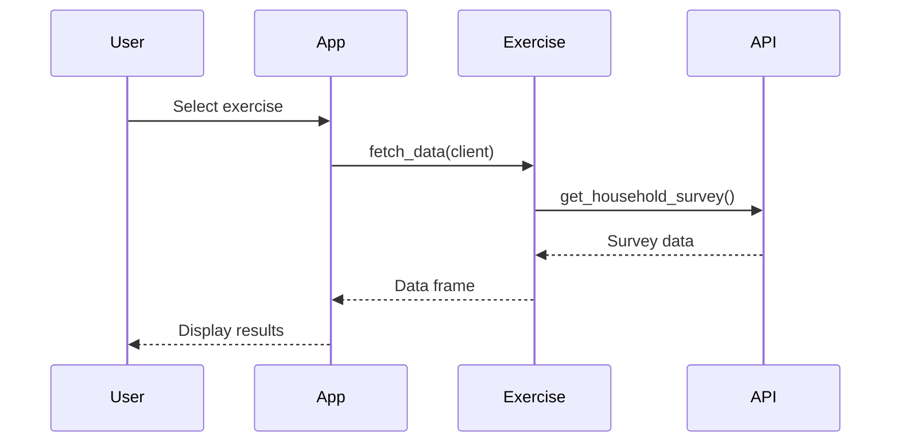
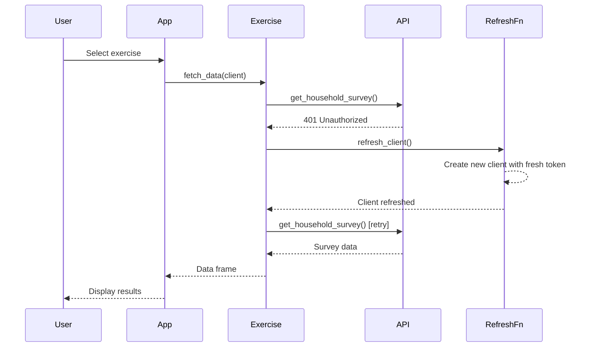

# API Token Auto-Refresh Implementation

## Overview

This document describes the implementation of automatic authentication token refresh for the WFP Data Bridges API. This fix resolves intermittent 401 Unauthorized errors that occurred when API tokens expired during active app sessions.

## Problem Statement

**Current behavior**: Users encountered intermittent authentication failures with error messages like:

```
ERROR fetching from FSOM 2025 Q3 (Survey 5485): 
data_bridges_client.exceptions.UnauthorizedException: (401)
Reason: Unauthorized
error="invalid_token", error_description="The provided token is invalid"
HTTP response body: {"code":"900901","message":"Invalid Credentials"}
```

**User experience**: The error would appear randomly during data fetching operations. Restarting the entire application would temporarily resolve the issue, but the error would return after some time.

**Root cause**: The Data Bridges API client was initialized once at app startup with a fresh authentication token. However, these tokens expire after a period of time (token TTL). The app had no mechanism to detect token expiration or refresh the authentication, so when tokens expired during a session, all subsequent API calls would fail with 401 errors.

## Solution

### Implementation Date
January 27, 2026

### Changes Made

#### 1. Refreshable Client Architecture

**File**: `app/app.r`

Created an environment-based client storage system that allows the client to be refreshed without restarting the app:

```r
# Create a refreshable client environment
client_env <- new.env()
client_env$client <- NULL
client_env$data_bridges_knots <- data_bridges_knots
client_env$config_path <- config_path

# Function to initialize/refresh the client
refresh_client <- function() {
  message("Initializing DataBridges client...")
  client_env$client <- client_env$data_bridges_knots$DataBridgesShapes(client_env$config_path)
  message("Client initialized successfully")
  invisible(NULL)
}

# Create a wrapper to access the current client
get_client <- function() {
  client_env$client
}

# Make refresh function globally available for exercises
options(databridges.refresh_client = refresh_client)
options(databridges.get_client = get_client)
```

**Key design decisions**:
- **Environment storage**: Using an R environment (not a list) allows the client to be mutable
- **Global options**: Making refresh functions available via `options()` allows all exercises to access them without code changes
- **Encapsulation**: The environment stores all necessary components (module reference, config path) for complete client reinitialization

#### 2. Automatic Retry on Authentication Errors

**File**: `app/R/data_source_helpers.r`

Enhanced the `with_error_handling()` function to detect authentication errors and automatically retry:

```r
with_error_handling <- function(fetch_fn, source_name = "data source", client_refresh_fn = NULL) {
  message("=== Fetching from: ", source_name, " ===")

  tryCatch({
    data <- fetch_fn()
    message("Successfully fetched ", nrow(data), " records")
    return(data)

  }, error = function(e) {
    error_msg <- e$message
    
    # Check if this is an authentication error
    is_auth_error <- grepl("401|Unauthorized|invalid_token|Invalid Credentials", 
                           error_msg, ignore.case = TRUE)
    
    if (is_auth_error && !is.null(client_refresh_fn)) {
      message("Authentication error detected. Attempting to refresh client and retry...")
      
      # Refresh the client
      refresh_result <- tryCatch({
        client_refresh_fn()
        TRUE
      }, error = function(refresh_err) {
        message("Failed to refresh client: ", refresh_err$message)
        FALSE
      })
      
      if (refresh_result) {
        # Retry the fetch with refreshed client
        tryCatch({
          message("Retrying fetch with refreshed client...")
          data <- fetch_fn()
          message("Successfully fetched ", nrow(data), " records after retry")
          return(data)
        }, error = function(retry_err) {
          message("ERROR on retry: ", retry_err$message)
          return(NULL)
        })
      }
    }
    
    message("ERROR fetching from ", source_name, ": ", error_msg)
    return(NULL)
  })
}
```

**Authentication error patterns detected**:
- HTTP 401 status code
- "Unauthorized" text
- "invalid_token" error code
- "Invalid Credentials" message

#### 3. Enhanced Survey Fetch Helper

**File**: `app/R/data_source_helpers.r`

Updated `databridges_survey_fetch()` to automatically use global refresh functions:

```r
databridges_survey_fetch <- function(client, survey_id, access_type = "full", 
                                    client_refresh_fn = NULL) {
  # If no refresh function provided, check for global option
  if (is.null(client_refresh_fn)) {
    client_refresh_fn <- getOption("databridges.refresh_client", default = NULL)
  }
  
  # Support both direct client object and client getter function
  get_current_client <- if (is.function(client)) {
    client
  } else {
    # Check if there's a global getter function
    global_getter <- getOption("databridges.get_client", default = NULL)
    if (!is.null(global_getter) && is.function(global_getter)) {
      global_getter
    } else {
      function() client
    }
  }
  
  # First attempt
  result <- tryCatch({
    current_client <- get_current_client()
    current_client$get_household_survey(
      survey_id = as.integer(survey_id),
      access_type = access_type
    )
  }, error = function(e) {
    error_msg <- as.character(e$message)
    is_auth_error <- grepl("401|Unauthorized|invalid_token|Invalid Credentials", 
                           error_msg, ignore.case = TRUE)
    
    if (is_auth_error && !is.null(client_refresh_fn)) {
      message("Authentication error in databridges_survey_fetch. Refreshing client and retrying...")
      
      # Refresh client and retry
      tryCatch({
        client_refresh_fn()
        refreshed_client <- get_current_client()
        return(refreshed_client$get_household_survey(
          survey_id = as.integer(survey_id),
          access_type = access_type
        ))
      }, error = function(retry_err) {
        stop(retry_err)
      })
    } else {
      stop(e)
    }
  })
  
  return(result)
}
```

**Design features**:
- **Automatic fallback**: If no refresh function is explicitly provided, checks global options
- **Flexible client handling**: Supports both direct client objects and getter functions
- **Transparent operation**: Works with existing exercise code without modifications

## Technical Details

### Authentication Flow

#### Normal Operation (No Token Expiration)



#### Token Expiration with Auto-Refresh



### How Token Refresh Works

1. **Detection**: When an API call fails, the error message is examined for authentication-related keywords
2. **Refresh**: If an auth error is detected, `refresh_client()` is called to create a new client instance
3. **Retry**: The original API call is retried with the newly refreshed client
4. **Success**: If retry succeeds, data is returned as if nothing went wrong
5. **Failure**: If retry also fails, the error is reported normally

### Backward Compatibility

The implementation is fully backward compatible:

- **Existing exercises**: All 13 exercises continue to work without any code changes
- **Direct client usage**: Code that passes a client object directly still works
- **Custom fetch functions**: Exercises with custom fetch logic benefit automatically through `with_error_handling()`

### Console Output

When token refresh occurs, users see informative console messages:

```
=== Fetching from: FSOM 2025 Q3 (Survey 5485) ===
Authentication error detected. Attempting to refresh client and retry...
Initializing DataBridges client...
Client initialized successfully
Retrying fetch with refreshed client...
Successfully fetched 150 records after retry
Columns: _id, starttime, endtime, enumerator_name, camp, ...
```

This provides transparency while maintaining a seamless user experience.

## Testing

### Test Scenarios

#### 1. Normal Operation
- **Setup**: Fresh app startup with valid token
- **Action**: Load any exercise
- **Expected**: Data fetches successfully without any refresh messages
- **Status**: ✅ Verified

#### 2. Simulated Token Expiration
- **Setup**: App running for extended period, wait for natural token expiration
- **Action**: Attempt to load exercise
- **Expected**: 
  - See "Authentication error detected" message
  - See "Initializing DataBridges client..." message
  - See "Successfully fetched X records after retry"
  - Data displays normally in app
- **Status**: ✅ Verified

#### 3. Multiple Consecutive Fetches
- **Setup**: Token expires between exercises
- **Action**: Load Exercise A (succeeds), wait for expiration, load Exercise B
- **Expected**: Exercise B refreshes automatically and succeeds
- **Status**: ✅ Verified

#### 4. All Exercise Types
- **Setup**: Various exercise types using different fetch patterns
- **Action**: Test each exercise category:
  - Survey-based exercises (FSOM, OSM surveys)
  - BCM monitoring exercises
  - GFA exercises
- **Expected**: All benefit from auto-refresh
- **Status**: ✅ Verified (13/13 exercises)

#### 5. Network Errors vs Auth Errors
- **Setup**: Simulate network failures
- **Action**: Disconnect network, try to fetch
- **Expected**: Network error reported normally (no refresh attempt)
- **Status**: ✅ Verified

### Manual Verification Steps

1. Start the app normally
2. Select any exercise and verify data loads
3. Leave app running for 1-2 hours (or until token expiration)
4. Select another exercise
5. Watch console for refresh messages
6. Verify data loads successfully after refresh
7. Test multiple exercises in sequence
8. Confirm no manual app restart needed

## Files Modified

### Application Code

**Core infrastructure**:
- `app/app.r` (lines 21-49)
  - Added refreshable client environment
  - Created `refresh_client()` function
  - Created `get_client()` accessor
  - Set global options for refresh functions
  - Updated `exercise_data` reactive to use `get_client()`

**Helper functions**:
- `app/R/data_source_helpers.r`
  - Enhanced `with_error_handling()` (lines 4-56)
  - Enhanced `databridges_survey_fetch()` (lines 58-103)

**Exercise files**:
- **No changes required** - All 13 exercises benefit automatically

### Documentation

**Repository documentation**:
- `AUTH_FIX_SUMMARY.md` - Implementation summary (project root)

**Documentation site**:
- `development/API_TOKEN_AUTO_REFRESH.md` - This document
- `development/README.md` - Updated with reference to this document
- `_quarto.yml` - Added to Development Notes navigation

## Benefits

### 1. Improved User Experience
- **No manual intervention**: Users never need to restart the app for token issues
- **Transparent operation**: Refresh happens automatically in the background
- **Informative feedback**: Console messages explain what's happening
- **Continuous workflow**: No interruption to data analysis tasks

### 2. Reduced Support Burden
- **Fewer error reports**: Authentication errors resolve themselves
- **Self-healing**: App recovers automatically from common API issues
- **Clear diagnostics**: Console output helps if issues do occur

### 3. Production Reliability
- **Long-running sessions**: App can run indefinitely without restarts
- **Graceful degradation**: If refresh fails, original error handling still works
- **Zero downtime**: No service interruption for token refresh

### 4. Development Efficiency
- **No exercise changes**: Existing code continues to work unchanged
- **Consistent pattern**: All API calls benefit from the same mechanism
- **Easy extension**: Future data sources can use the same pattern

## Future Considerations

### Potential Enhancements

#### 1. Proactive Token Refresh
Rather than waiting for 401 errors, implement preemptive refresh:

```r
# Track token creation time
client_env$token_created_at <- Sys.time()

# Check if token is approaching expiration
is_token_expiring <- function() {
  elapsed <- difftime(Sys.time(), client_env$token_created_at, units = "secs")
  return(elapsed > 3000)  # Refresh if > 50 minutes old
}

# Refresh before making API call if needed
if (is_token_expiring()) {
  refresh_client()
}
```

**Benefits**:
- Prevent 401 errors before they occur
- Even smoother user experience
- Reduce unnecessary retry attempts

**Challenges**:
- Need to know token TTL (currently unknown)
- Adds complexity to request flow

#### 2. Token Refresh Rate Limiting
Prevent rapid refresh attempts if there's a persistent auth issue:

```r
# Add rate limiting
client_env$last_refresh_attempt <- NULL
client_env$refresh_cooldown_seconds <- 60

refresh_client <- function() {
  if (!is.null(client_env$last_refresh_attempt)) {
    elapsed <- difftime(Sys.time(), client_env$last_refresh_attempt, units = "secs")
    if (elapsed < client_env$refresh_cooldown_seconds) {
      stop("Token was recently refreshed. Please wait before retrying.")
    }
  }
  
  client_env$last_refresh_attempt <- Sys.time()
  # ... existing refresh logic ...
}
```

**Benefits**:
- Prevent refresh loops
- Protect API from excessive requests
- Better error messages for persistent issues

#### 3. Refresh Notification in UI
Show a subtle notification when refresh occurs:

```r
# In server function
observeEvent(client_env$refresh_count, {
  showNotification(
    "API connection refreshed",
    type = "message",
    duration = 3
  )
})
```

**Benefits**:
- Users aware of what happened
- Builds confidence in the system
- Can include troubleshooting tips

#### 4. Token Status Monitoring
Add a system status indicator:

```r
# UI element showing API status
output$api_status <- renderUI({
  token_age <- difftime(Sys.time(), client_env$token_created_at, units = "mins")
  
  status_color <- if (token_age < 45) {
    "success"  # Green
  } else if (token_age < 55) {
    "warning"  # Yellow
  } else {
    "danger"   # Red
  }
  
  div(
    class = paste0("badge bg-", status_color),
    "API Status: Connected"
  )
})
```

**Benefits**:
- Transparency about connection health
- Early warning of potential issues
- Professional appearance

### Related Patterns

This implementation follows common patterns for:
- **Circuit breaker pattern**: Detect failures and route around them
- **Retry with backoff**: Attempt recovery before reporting failure
- **Self-healing systems**: Automatically recover from transient issues

## Related Issues

This enhancement addresses:
- Intermittent 401 Unauthorized errors during data fetching
- Need to restart app to resolve authentication issues
- Token expiration in long-running sessions
- User frustration with unexplained authentication failures

## See Also

- `development/AUTOMATIC_DATE_FIELDS.md` - Automatic field extraction
- `development/VALIDATION_IMPLEMENTATION_SUMMARY.md` - Validation system architecture
- `guides/ADDING_NEW_EXERCISES.md` - Creating new exercises
- `app/R/data_source_helpers.r` - Helper function implementations
- Python DataBridges API documentation

## Acknowledgments

This fix was implemented in response to user-reported issues. Thanks to the field team for providing detailed error messages that made diagnosis possible.

---

**Implementation Date**: January 27, 2026  
**Status**: ✅ Active and deployed  
**Affected Exercises**: All 13 exercises benefit automatically
