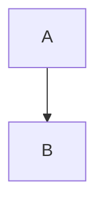

# Building the Documentation Site

This documentation uses [Quarto](https://quarto.org/) to generate a beautiful, searchable website from markdown files.

## Prerequisites

Install Quarto (if not already installed):

- Download from: https://quarto.org/docs/get-started/
- Or via Homebrew: `brew install quarto`

## Quick Start

### Preview the Site Locally

From the repository root:

```bash
quarto preview
```

This will:

- Build the site
- Start a local web server
- Open your browser
- Auto-reload when you edit files

### Build the Site

To build without serving:

```bash
quarto render
```

The rendered site will be in `_site/`

## Publishing Options

### Option 1: GitHub Pages (Recommended)

1. **Enable GitHub Pages** for your repository:
   - Go to repository Settings > Pages
   - Source: GitHub Actions

2. **Create GitHub Action** (`.github/workflows/publish-docs.yml`):

```yaml
name: Publish Documentation

on:
  push:
    branches: [main, master]
  workflow_dispatch:

permissions:
  contents: read
  pages: write
  id-token: write

jobs:
  build-deploy:
    runs-on: ubuntu-latest
    steps:
      - name: Check out repository
        uses: actions/checkout@v4

      - name: Set up Quarto
        uses: quarto-dev/quarto-actions/setup@v2

      - name: Render Quarto Project
        uses: quarto-dev/quarto-actions/render@v2
        with:
          path: .

      - name: Upload artifact
        uses: actions/upload-pages-artifact@v2
        with:
          path: _site

      - name: Deploy to GitHub Pages
        id: deployment
        uses: actions/deploy-pages@v2
```

3. **Push to GitHub** and your docs will automatically deploy!

### Option 2: Netlify

From the `docs/` directory:

```bash
quarto publish netlify
```

### Option 3: Manual Deployment

Build the site and upload `_site/` to any web host.

## Project Structure

```
.
├── _quarto.yml          # Main configuration
├── index.qmd            # Home page
├── styles.css           # Custom CSS
├── custom.scss          # Theme customization
├── guides/              # User guides
├── examples/            # Example implementations
├── development/         # Development notes
└── _site/              # Generated site (gitignored)
```

## Configuration

### Site Metadata

Edit `_quarto.yml` to customize:

- Site title and URL
- GitHub repository links
- Navigation structure
- Theme colors
- Search settings

### Theme Customization

Edit `custom.scss` to change:

- Brand colors
- Typography
- Spacing
- Component styling

### Custom Styling

Edit `styles.css` for:

- Layout adjustments
- Component-specific styles
- Responsive design tweaks

## Adding New Pages

### Add a New Markdown File

1. Create `new-page.md` in appropriate directory
2. Add front matter (optional):

```yaml
---
title: "Page Title"
---
```

3. Update `_quarto.yml` navigation:

```yaml

- text: "New Page"
  href: path/to/new-page.md
```

### Convert Existing MD to QMD

Quarto works with `.md` files as-is, but `.qmd` files enable:

- R code execution
- Advanced layouts
- Embedded Shiny apps
- Interactive elements

To convert:

1. Rename `file.md` → `file.qmd`
2. Add executable R chunks if needed:

````markdown
\```{r}
#| echo: false
# R code here
\```
````

## Features

### Search

Full-text search is enabled by default. Users can:

- Click search icon in navbar
- Use keyboard: `/` or `Ctrl+K`

### Code Blocks

Features enabled:

- **Copy button** - Click to copy code
- **Line numbers** - For easy reference
- **Syntax highlighting** - Automatic detection
- **Overflow wrap** - Long lines wrap nicely

### Table of Contents

Each page has:

- Right sidebar TOC (on wide screens)
- Auto-generated from headings
- Up to 3 levels deep
- Smooth scroll navigation

### Navigation

- **Breadcrumbs** - Show current location
- **Next/Previous** - Navigate sequentially
- **Back to Top** - Appears when scrolling

### Callouts

Use special callout blocks:

```markdown
::: {.callout-note}
This is a note
:::

::: {.callout-tip}
This is a tip
:::

::: {.callout-warning}
This is a warning
:::
```

### Diagrams

Mermaid diagrams are supported:

````

````

## Troubleshooting

### "Command not found: quarto"

Install Quarto: https://quarto.org/docs/get-started/

### Changes Not Appearing

1. Stop preview (`Ctrl+C`)
2. Clear cache: `rm -rf .quarto`
3. Restart: `quarto preview`

### Links Not Working

- Use relative paths: `guides/QUICK_START.md`
- Not absolute: `/guides/QUICK_START.md`
- Update `_quarto.yml` if restructuring

### Styling Not Applied

- Check `styles.css` and `custom.scss` are in the repository root
- Verify paths in `_quarto.yml` format section
- Clear browser cache

## Development Workflow

### Typical Workflow

1. **Make edits** to markdown files
2. **Preview locally**: `quarto preview`
3. **Review changes** in browser (auto-reloads)
4. **Commit changes** to git
5. **Push to GitHub** - Docs deploy automatically!

### Best Practices

- ✅ Use descriptive page titles
- ✅ Add front matter to QMD files
- ✅ Keep navigation structure logical
- ✅ Test links before committing
- ✅ Preview on mobile (responsive design)
- ✅ Use callouts for important notes
- ✅ Include code examples with copy buttons

## Resources

- **Quarto Documentation**: https://quarto.org/docs/guide/
- **Quarto Gallery**: https://quarto.org/docs/gallery/
- **GitHub Pages**: https://docs.github.com/en/pages
- **Mermaid Diagrams**: https://mermaid.js.org/

---

**Need help?** Check the [Quarto Guide](https://quarto.org/docs/guide/) or open an issue in the repository.

